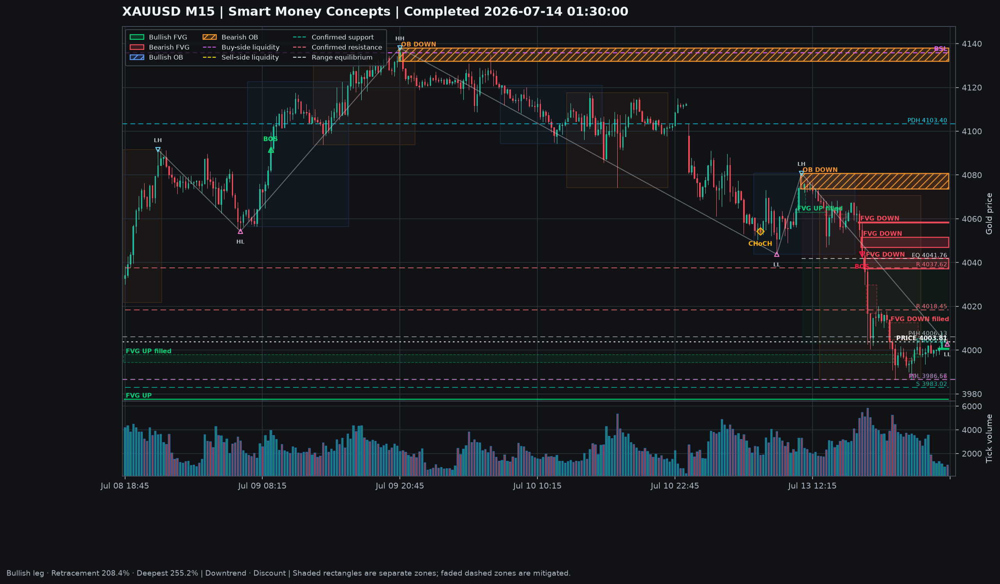

# XAUUSD Smart Money Concepts Dashboard

A local Python application for analyzing gold/forex candles from MetaTrader 5, displaying Smart Money Concepts on an interactive chart, and testing a simple rule-based strategy with historical data.

The application combines:

```text
MetaTrader 5 candles
        |
        v
smartmoneyconcepts indicators
        |
        v
Plotly dashboard + mplfinance snapshot
        |
        v
backtesting.py strategy simulation
```

> This project is for education and research. Its indicators and backtest results are not financial advice, forecasts, or guarantees of future performance.



## Features

- Downloads completed XAUUSD M15 candles from MetaTrader 5.
- Detects separate bullish and bearish Fair Value Gaps.
- Draws bullish and bearish order blocks.
- Shows BOS, CHoCH, liquidity pools, and liquidity sweeps.
- Maps swing structure as HH, HL, LH, LL, support, and resistance.
- Calculates premium, discount, and equilibrium within the current dealing range.
- Adds previous daily/4H levels, London/New York sessions, and retracements.
- Provides an interactive Plotly chart with indicator filters, time-range controls, candle-focused vertical scaling, zoom, export, and fullscreen support.
- Creates a clean mplfinance PNG chart.
- Recalculates after each newly completed MT5 candle.
- Runs a causal backtesting.py strategy and creates an interactive performance report and trade list.

## Requirements

- Windows
- Python and `pip`
- MetaTrader 5 desktop terminal
- A logged-in MT5 account with a gold symbol supplied by the broker

The default symbol is `XAUUSD`. Some brokers use names such as `XAUUSDm`, `XAUUSD.a`, or `GOLD`; see [Changing the symbol](docs/USAGE.md#changing-the-symbol) if needed.

## Quick start

Open PowerShell in the folder where you want the project and run:

```powershell
git clone https://github.com/itsmustafa119/goldSmcProject.git
cd goldSmcProject
py -m venv .venv
.venv\Scripts\python.exe -m pip install --upgrade pip
.venv\Scripts\python.exe -m pip install -r requirements.txt
```

Then:

1. Open MetaTrader 5 and log in.
2. Double-click `start_gold_smc.bat`.
3. Keep the terminal window open while using the dashboard.
4. Press `Ctrl+C` in that window to stop the application.

The application opens the dashboard automatically. Its default address is:

```text
http://127.0.0.1:8765/
```

If that port is busy, the terminal prints the next available address.

For a slower, step-by-step walkthrough, read [Simple usage documentation](docs/USAGE.md).

## Dashboard controls

| Control | Purpose |
| --- | --- |
| Indicators | Show or hide individual SMC layers and labels |
| 1D / 3D / 1W / All | Change the visible candle range |
| Y+ / Y- | Zoom the price axis vertically |
| Y Auto | Fit the vertical scale to the visible candles |
| Summary | Open current market values and indicator definitions |
| Export | Save the Plotly chart as a PNG |
| MPL View | Open the cleaner mplfinance chart |
| Backtest | Open the interactive strategy report |
| Fullscreen | Expand the chart to the full screen |
| Help | Show mouse and keyboard instructions |

Keyboard shortcuts are also available: `1`, `3`, `7`, `R`, `+`, `-`, `0`, `I`, `S`, `E`, `P`, `B`, `F`, and `H`.

## Generated files

These files are recreated while the application runs. The data and HTML reports are excluded from Git; the example snapshot is tracked so it can be shown in this README.

| File | Description |
| --- | --- |
| `xauusd_m15_smc_results.csv` | Candles and all calculated indicator columns |
| `xauusd_m15_smc_chart.html` | Standalone interactive Plotly dashboard |
| `xauusd_m15_smc_snapshot.png` | Clean mplfinance chart image |
| `xauusd_m15_smc_backtest.html` | Interactive backtesting.py result |
| `xauusd_m15_smc_trades.csv` | Completed simulated trades |

## Backtest rules

The included strategy is a transparent baseline, not an optimized trading system.

- A long setup requires a confirmed uptrend, bullish structure bias, and a move into discount.
- A short setup requires a confirmed downtrend, bearish structure bias, and a move into premium.
- Swing-derived values are delayed by the swing confirmation window to reduce look-ahead bias.
- BOS and CHoCH are assigned to the candle that actually breaks the structure level.
- The stop uses the dealing-range boundary and a minimum ATR distance.
- The default target is `2R`.
- Only one simulated position is open at a time.

Default assumptions are visible in the dashboard and can be changed near the top of `analyze_gold_mt5.py`.

Backtests still omit or simplify real-world effects such as broker contract sizing, variable spreads, slippage, financing, news restrictions, and failed execution.

## Configuration

The main settings are grouped at the top of `analyze_gold_mt5.py`:

| Setting | Default | Meaning |
| --- | ---: | --- |
| `SYMBOL` | `XAUUSD` | MT5 instrument name |
| `TIMEFRAME` | `M15` | Candle timeframe |
| `NUMBER_OF_CANDLES` | `5000` | Historical candles requested from MT5 |
| `SWING_LENGTH` | `20` | Swing confirmation window |
| `LIVE_MODE` | `True` | Keep the local dashboard server running |
| `LIVE_REFRESH_SECONDS` | `5` | Frequency of MT5 checks |
| `BACKTEST_RISK_REWARD` | `2.0` | Take-profit multiple of initial risk |
| `BACKTEST_POSITION_FRACTION` | `0.10` | Fractional position size used by the simulator |

After changing a setting, stop and restart the launcher.

## Project structure

```text
goldSmcProject/
|-- analyze_gold_mt5.py   # MT5 data, indicators, charts, dashboard, and live server
|-- smc_backtest.py       # Causal strategy preparation and backtesting.py integration
|-- start_gold_smc.bat    # One-click Windows launcher
|-- requirements.txt      # Python dependencies
|-- docs/
|   `-- USAGE.md          # Simple installation and usage guide
`-- xauusd_m15_smc_snapshot.png
```

## Libraries used

- [joshyattridge/smart-money-concepts](https://github.com/joshyattridge/smart-money-concepts) for FVG, swing, BOS/CHoCH, order-block, liquidity, level, session, and retracement calculations.
- [Plotly](https://plotly.com/python/) for the main interactive dashboard.
- [matplotlib/mplfinance](https://github.com/matplotlib/mplfinance) for the clean static financial chart.
- [kernc/backtesting.py](https://github.com/kernc/backtesting.py) for strategy execution, statistics, trade markers, and the interactive backtest report.
- The structure map and dealing-range presentation were also informed by [rabichawila/smart-money-py](https://github.com/rabichawila/smart-money-py).

## Important limitations

- SMC definitions vary between traders; these labels are algorithmic interpretations.
- Confirmed swing indicators necessarily appear after later candles confirm the pivot.
- Historical results depend strongly on data quality and execution assumptions.
- Test with broker-specific symbol details and a demo account before using the analysis in any real decision.
