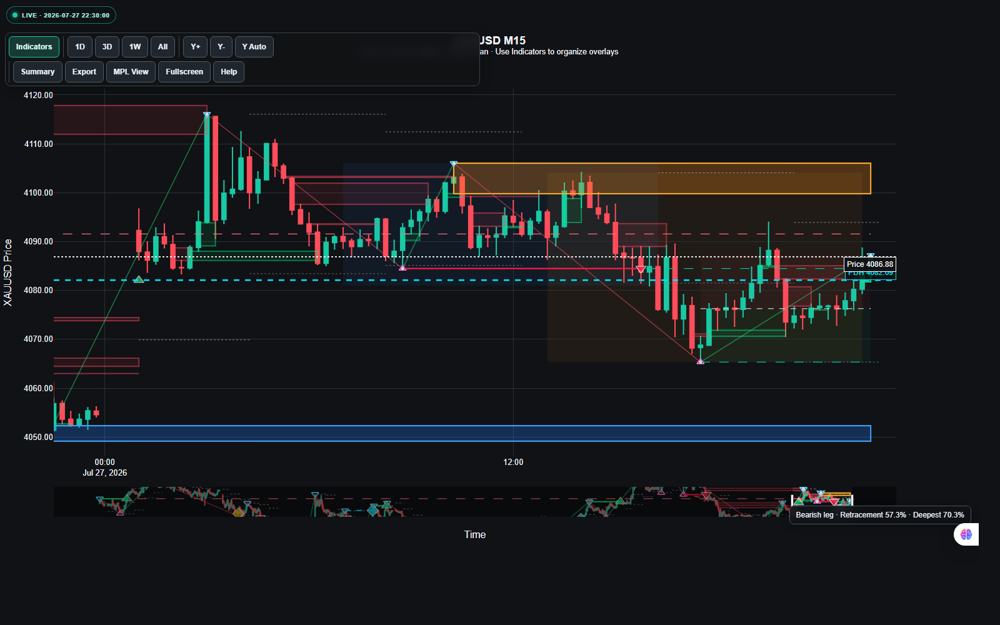
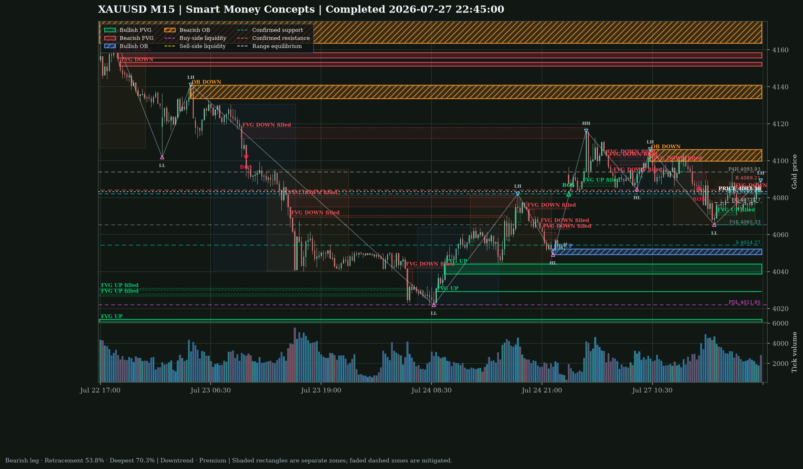
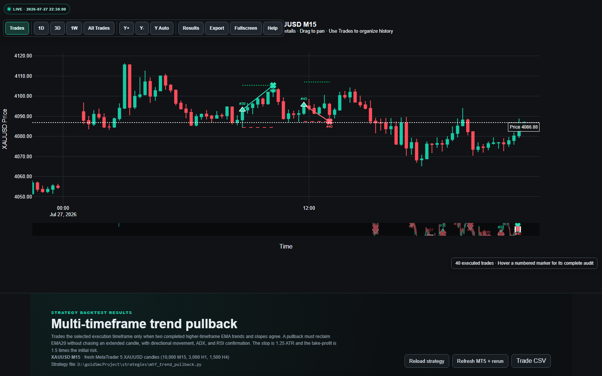

# MT5 Smart Money Concepts

[](https://www.python.org/)
[](https://www.metatrader5.com/)
[](https://plotly.com/python/)
[](tests/)

An interactive market-analysis and strategy-backtesting toolkit built around
MetaTrader 5, completed candles, and auditable Smart Money Concepts signals.



## Two focused workflows

| Workflow | Launcher | Purpose |
| --- | --- | --- |
| Market analysis | `run_analysis.bat` | Display FVGs, order blocks, liquidity, structure, sessions, and confluence on an interactive chart. |
| Strategy backtest | `run_backtest.bat` | Apply a strategy file and inspect its entries, exits, stop-losses, take-profits, balance, and trade history. |

Both launchers ask for an MT5 instrument and an execution timeframe in the
terminal. M15, H1, and H4 are supported, and custom broker symbol names can be
entered.

## Quick start

Requirements:

- Windows;
- MetaTrader 5 installed, open, logged in, and connected;
- Python 3.11 or newer;
- a virtual environment named `.venv`.

Install the dependencies:

```powershell
.venv\Scripts\python.exe -m pip install -r requirements.txt
```

Then double-click either `run_analysis.bat` or `run_backtest.bat`.

## Market analysis

The analysis dashboard uses completed MT5 candles and refreshes after a newly
completed candle is available. It can display:

- fair value gaps and whether they have been mitigated;
- bullish and bearish order blocks;
- buy-side and sell-side liquidity;
- liquidity sweeps;
- BOS and CHoCH structure events;
- swing structure and the active dealing range;
- previous daily and four-hour levels;
- London and New York sessions;
- retracement, confluence, and live-session panels.

### Detailed chart example



In this example, green and red zones represent bullish and bearish FVGs,
hatched blue and orange zones represent order blocks, dashed horizontal levels
represent liquidity or reference levels, and labeled swing points explain the
detected structure.

## Strategy backtesting

Choose the instrument, execution timeframe, and one of the retained strategy
files:

| Strategy | Main idea |
| --- | --- |
| `strategies/mtf_trend_pullback.py` | Align higher-timeframe trends, then enter an execution-timeframe pullback with momentum confirmation. |
| `strategies/ict_liquidity_fvg.py` | Look for liquidity and fair-value-gap conditions before entering. |
| `strategies/confirmed_smc_pullback.py` | Require confirmed SMC structure and a valid pullback before entering. |



The report includes:

- numbered entries and exits on the same chart style as the analysis workflow;
- each trade's initial stop-loss and take-profit;
- overall win rate, balance, net P&L, profit factor, and drawdown;
- complete trade history;
- indicator values captured when each entry was taken;
- CSV export for an independent audit.

Backtests use completed candles and modeled execution costs. Historical results
are simulations, not guarantees of future performance.

## Command-line use

The launchers also accept arguments for repeatable runs:

```powershell
run_analysis.bat --symbol EURUSD --timeframe H1

run_backtest.bat --symbol XAUUSD --timeframe M15 --strategy strategies\ict_liquidity_fvg.py
```

Backtest-only options:

- `--use-cache` reuses the latest cached candles;
- `--no-browser` does not open the report automatically;
- `--once` writes the result and exits without keeping a local service open.

## Project structure

```text
gold_smc/          Shared chart, MT5, indicator, dashboard, and backtest code
strategies/        Editable strategy definitions
tests/             Automated regression tests
docs/images/       README screenshots and trading-chart examples
run_analysis.bat   Market-analysis launcher
run_backtest.bat   Strategy-backtest launcher
```

Runtime files are written to `outputs/` and excluded from Git. The local Plotly
runtime is generated automatically when it is missing.

## Topics

`metatrader5` · `smart-money-concepts` · `algorithmic-trading` · `backtesting`
· `technical-analysis` · `price-action` · `forex` · `xauusd` · `plotly` ·
`python`

See [docs/USAGE.md](docs/USAGE.md) for detailed usage and troubleshooting.
